# Attack Trees for In-Scope Threats

This document applies **attack tree** analysis to the threats identified in `report.md`. The approach follows the [NCSC guidance on using attack trees to understand cyber security risk](https://www.ncsc.gov.uk/collection/risk-management/using-attack-trees-to-understand-cyber-security-risk).

## Method

- **Root node:** The attacker’s objective or the core security concern (the threat outcome).
- **Child nodes:** Steps or conditions that can lead to that outcome. Each branch represents a causal link; multiple branches from one node represent **alternative** ways to achieve the parent (OR).
- **Leaf nodes:** Atomic steps with no further decomposition (no steps beneath them).
- **Paths:** Each path from a leaf to the root is a distinct attack path. Paths are unique; there are no loops.

The trees are built by (1) stating the core issue (root), (2) identifying how an attacker can achieve it, (3) repeating for each new node until leaf nodes are reached. Evaluation of the tree highlights where risk and mitigations sit.

---

## 1. API Gateway

### 1.1 Spoofing: Gateway accepts requests as the victim (tokens stolen)

**Root:** Attacker’s requests are accepted by the Gateway as the victim.

**Attack paths explored:**
- Obtain a valid token that belongs to the victim (e.g. steal from client storage, intercept in transit, extract from logs or a compromised device), then present it to the Gateway.
- Reuse a token after the victim has logged out if revocation is weak or delayed.
- Use a long-lived or non-revokable token so theft has a long window of use.

**Leaf nodes:** Steal token from client storage; intercept token in transit; extract token from logs or compromised device; reuse token after logout (no/weak revocation); use long-lived token.

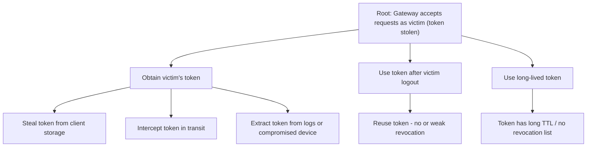

---

### 1.3 Tampering: Request/response tampering in transit (Gateway–backends)

**Root:** Request or response is tampered with in transit between Gateway and backends.

**Attack paths explored:**
- Send or modify traffic on a hop that does not use TLS (or uses weak/downgraded TLS).
- Perform MitM on a link where TLS is not enforced or certificate validation is weak.
- Inject or alter payloads if integrity (e.g. signing) is not enforced.

**Leaf nodes:** Hop without TLS; TLS downgrade or weak cipher; MitM on unencrypted or weakly validated link; no integrity/signing on payloads.

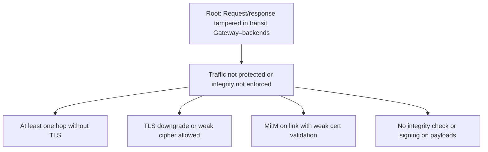

---

### 1.4 Repudiation: No sufficient audit trail for API/payment

**Root:** No reliable audit trail of which identity called which API or payment; dispute or forensics impossible.

**Attack paths explored:**
- Gateway does not log principal identity, request ID, or path.
- Logs are not retained or are not sent to SIEM; they are altered or deleted.
- Payment-related calls are logged without redaction or not logged in a usable way for disputes.

**Leaf nodes:** Gateway does not log principal/method/path; logs not retained or not in SIEM; logs altered or deleted; payment intent not logged or not redacted.

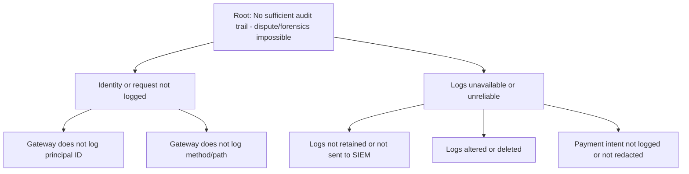

---

### 1.5 Information disclosure: Misrouting leaks PII or payment data

**Root:** PII or payment data is sent to the wrong service (misrouting).

**Attack paths explored:**
- Route or header manipulation causes Gateway to send auth/payment data to a non-payment or non-auth service.
- Payment service receives raw card data instead of tokenized reference because routing or payload is misconfigured.
- Path or header used for routing is attacker-controlled or not validated.

**Leaf nodes:** Route/header manipulation; Gateway routes by untrusted input; Payment receives raw card instead of tokenized ref; path/header not validated.

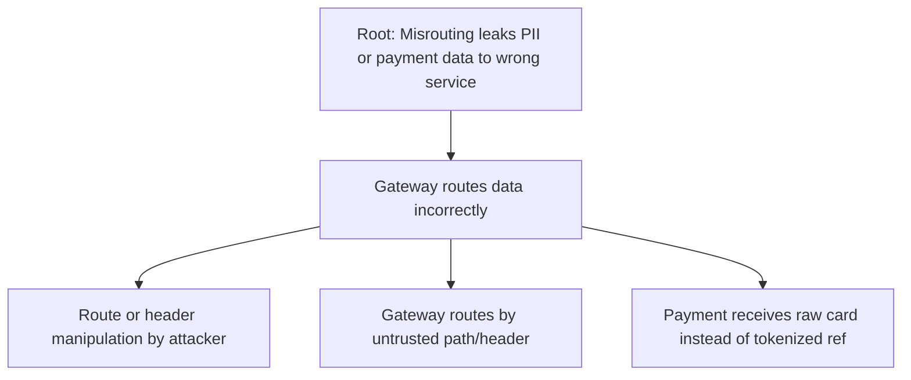

---

### 1.6 Information disclosure: Verbose logging leaks PII or payment data

**Root:** PII or payment data is exposed via log sinks.

**Attack paths explored:**
- Gateway (or a component) logs request/response bodies for auth or payment endpoints.
- Logs are stored or forwarded to sinks with broad access; an insider or compromise exposes them.
- Sensitive fields (tokens, card data) are not redacted before logging.

**Leaf nodes:** Log request/response bodies for auth or payment; log access too broad; no redaction of tokens or card data in logs.

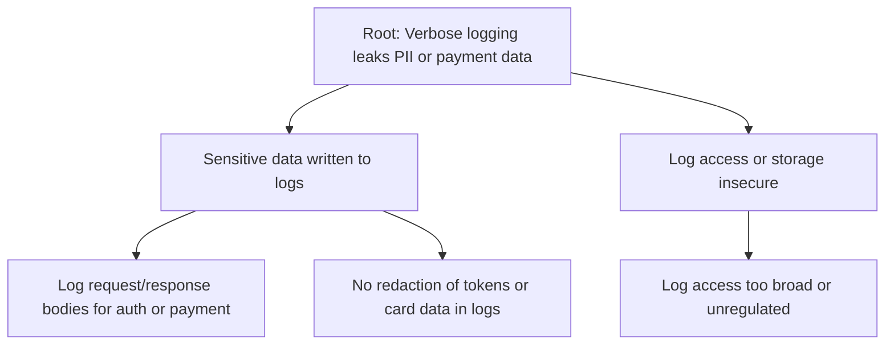

---

### 1.7 Denial of service: Platform-wide outage via Gateway

**Root:** Rate limiting bypass or resource exhaustion causes platform-wide outage (Gateway as single point of entry).

**Attack paths explored:**
- Bypass or exceed rate limits (e.g. distributed sources, identity sprawl, or limits not applied per identity/IP).
- Exhaust Gateway or backend resources (e.g. expensive operations, large payloads, connection exhaustion).
- WAF or Gateway quotas misconfigured or not applied; no circuit-breaker so backends are overloaded.
- No staging to test Gateway changes; a bad config/update causes outage.

**Leaf nodes:** Bypass rate limits (distributed or per-identity gap); exhaust Gateway CPU/memory/connections; exhaust backend via Gateway; WAF/Gateway quotas missing or misconfigured; no circuit-breaker; bad Gateway config/update in production (no staging).

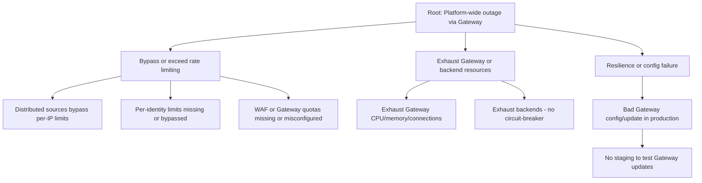

---

### 1.8 Elevation of privilege: Backends or admin routes exposed

**Root:** Backends reachable without going through Gateway, or admin/internal routes exposed; privilege escalation.

**Attack paths explored:**
- Auth or Payment (or other backends) are directly reachable from the internet (e.g. misconfigured network or DNS).
- Admin or internal Gateway routes are reachable without strong auth or network restriction.
- Attacker discovers internal route or backend endpoint and accesses it without going through Gateway.

**Leaf nodes:** Auth/Payment directly internet-reachable; admin routes reachable without VPN/IP allowlist; admin routes without strong authn and authz; internal route discovered and called directly.

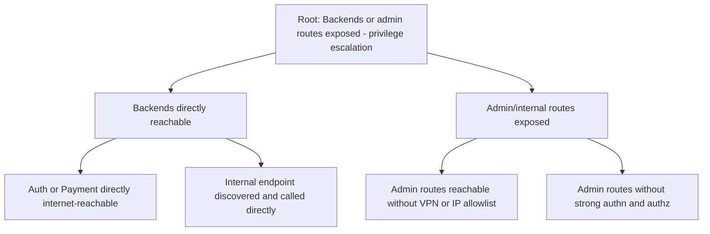

---

## 2. Auth Service (Identity)

### 2.1 Spoofing: Credential stuffing or phishing → account takeover

**Root:** Account takeover via credential stuffing or phishing.

**Attack paths explored:**
- Obtain credentials via phishing (link, site, or message) and use them to log in.
- Use credential stuffing with leaked or breached passwords; no breach-list check or MFA.
- Use weak or reused password; no strong policy or MFA for high-risk actions.

**Leaf nodes:** Phishing captures credentials; user reuses breached password; no breach-list check; no MFA for login or sensitive actions; weak password policy.

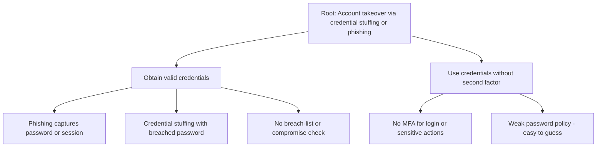

---

### 2.2 Spoofing: Session token theft → act as user

**Root:** Attacker acts as user by using stolen session token.

**Attack paths explored:**
- Steal session token (client storage, transit, logs, or device) and use it before expiry or revocation.
- Session not bound to device/fingerprint so stolen token works from another device.
- Long session TTL or no refresh/revocation so stolen token remains valid.

**Leaf nodes:** Steal token from storage/transit/logs/device; session not bound to device/fingerprint; long TTL or no rotation; no revocation on logout or privilege change.

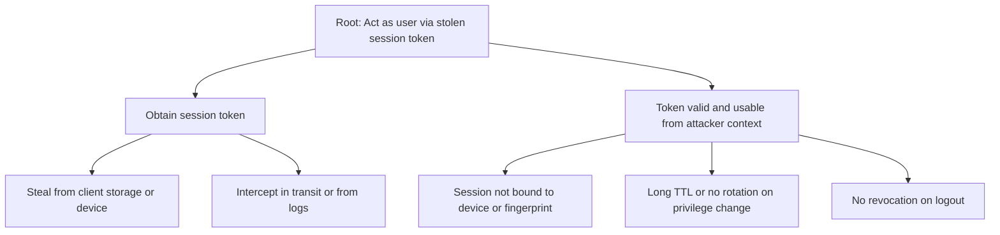

---

### 2.3 Tampering: Password reset flow → attacker resets victim password

**Root:** Attacker resets victim’s password (reset flow tampered).

**Attack paths explored:**
- Obtain reset token (e.g. leak, reuse, or intercept) and submit it to complete reset.
- Reset token is long-lived or reusable; no binding to email or rate limit.
- Abuse reset flow (e.g. no rate limit, no one-time use) to brute-force or reuse tokens.

**Leaf nodes:** Reset token leaked or intercepted; reset token reusable or long-lived; reset not bound to email; no rate limit on reset requests; one-time use not enforced.

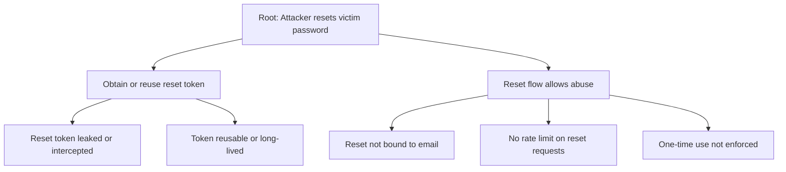

---

### 2.4 Tampering: Age flag tampered → bypass child protections

**Root:** Child protections bypassed by tampering with age flag.

**Attack paths explored:**
- Modify age or age-related attribute in request or token so user is treated as adult.
- Age stored or transmitted in a way that is not integrity-checked or signed; client or intermediate can change it.
- Gateway or backends do not enforce age from Auth; they trust client or unsigned attribute.

**Leaf nodes:** Age/attribute modified in request or token; age not integrity-checked or signed; Gateway/backends do not enforce Auth age; client-supplied age trusted.

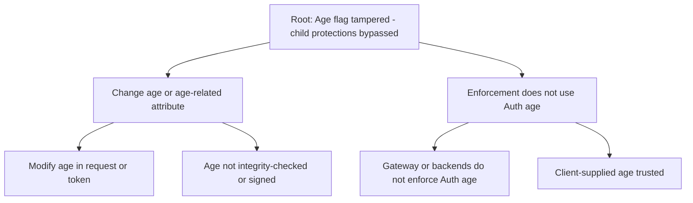

---

### 2.5 Repudiation: User denies login or action; no non-repudiation

**Root:** User denies having logged in or performed action; no non-repudiation.

**Attack paths explored:**
- Auth does not log login, MFA, reset, or failure with identity, timestamp, IP, outcome.
- Logs are not retained, not protected, or altered so they cannot be used for dispute.
- No binding of sensitive actions to a logged auth event.

**Leaf nodes:** Auth does not log login/MFA/reset/failure with identity and outcome; logs not retained or not protected; logs altered; sensitive action not tied to logged auth event.

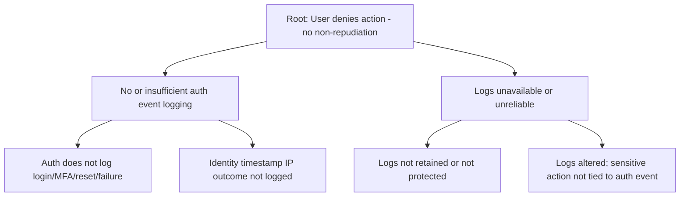

---

### 2.6 Information disclosure: PII (especially minors) disclosed

**Root:** PII (especially minors) disclosed via Auth DB, logs, or API response.

**Attack paths explored:**
- Auth stores more PII than necessary; sensitive fields not encrypted at rest; passwords or full tokens logged.
- Auth API responses to Gateway/Payment include more data than needed; downstream leaks.
- Underage data not handled per COPPA/GDPR-K (consent, retention, access control).

**Leaf nodes:** Excess PII stored; sensitive fields not encrypted at rest; passwords or full tokens in logs; Auth API returns more than Gateway/Payment need; underage data consent/retention/access not enforced.

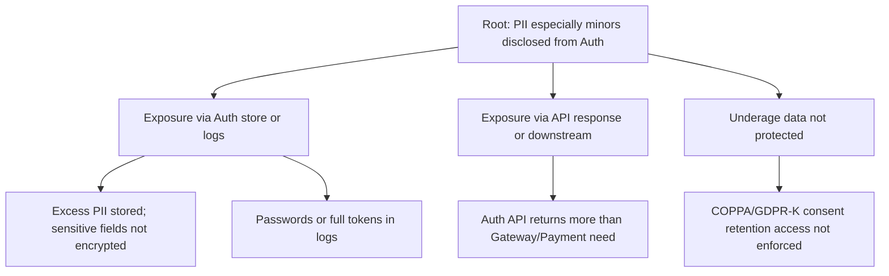

---

### 2.7 Denial of service: Auth endpoint exhausted

**Root:** Auth endpoint exhausted (e.g. login floods); all dependent services fail.

**Attack paths explored:**
- Flood login, register, or reset endpoints (per IP or per account) to exhaust capacity.
- No CAPTCHA or similar on unauthenticated auth endpoints; bots can amplify.
- Auth does not scale or circuit-break; no backoff or queue so cascading failure.

**Leaf nodes:** Flood login/register/reset per IP or account; no CAPTCHA on unauthenticated auth; Auth does not scale or circuit-break; no backoff or queue.

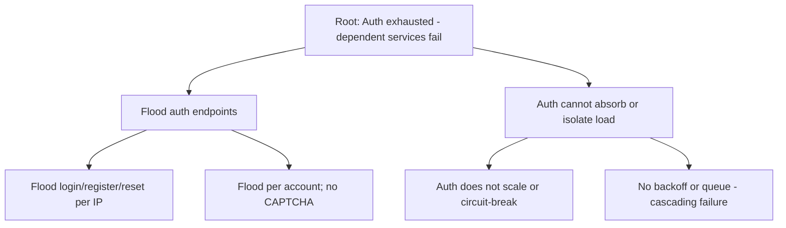

---

### 2.8 Elevation of privilege: Privilege escalation (e.g. admin)

**Root:** Attacker gains elevated privilege (e.g. admin).

**Attack paths explored:**
- Modify role in token or request and have it accepted (no server-side role validation from Auth DB).
- Escalate by exploiting missing or weak RBAC (roles not stored or not validated on each request).
- Access admin function because role is only checked at UI or one layer, not at API.

**Leaf nodes:** Role in token or request modified and accepted; roles not stored in Auth DB or not validated per request; RBAC missing or weak; role check only at UI not API.

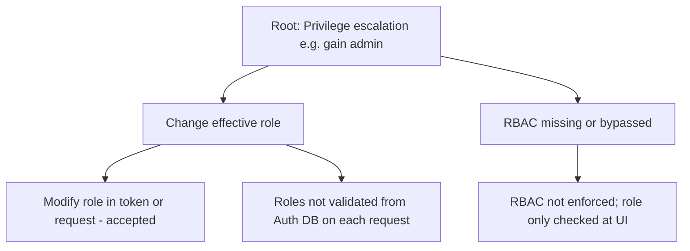

---

### 2.9 Elevation of privilege: MFA bypass (recovery or social engineering)

**Root:** MFA bypassed via recovery codes or social engineering.

**Attack paths explored:**
- Obtain or abuse MFA recovery codes (e.g. guess, steal, or social engineer from support).
- Support or process allows MFA reset or bypass without proper verification; no audit of recovery use.
- Attacker uses recovery option that is too permissive or not rate-limited.

**Leaf nodes:** Recovery codes guessed stolen or phished; support bypasses MFA without verification; recovery use not audited; recovery option too permissive or not rate-limited.

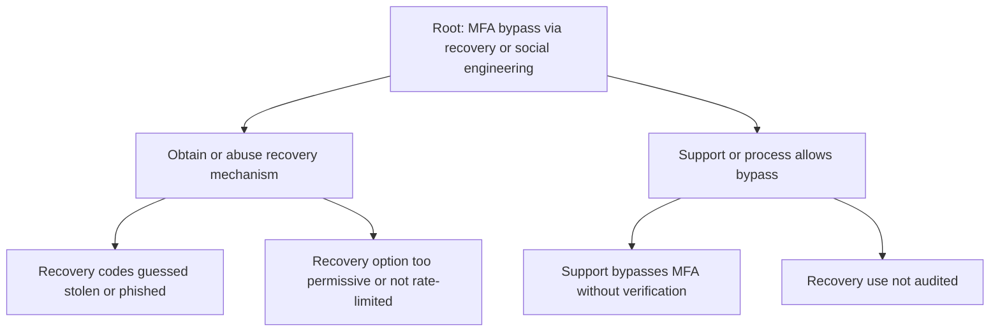

---

## 3. External Payment Service

### 3.1 Spoofing: Payment initiated as another user

**Root:** Payment is initiated as another user (identity not strongly bound).

**Attack paths explored:**
- Send payment request with a different user ID than the authenticated user; server trusts client-supplied identity.
- Gateway or orchestrator does not pass a stable, verified user ID from Auth to Payment; Payment does not reject mismatch.
- Token or session swapped or forged so Payment sees wrong identity.

**Leaf nodes:** Client-supplied user ID trusted for payment; Gateway does not pass verified user ID; Payment does not reject user ID mismatch; token/identity swapped or forged.

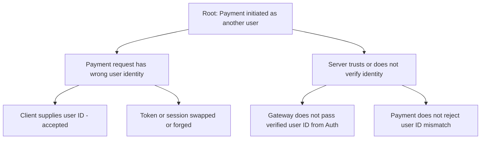

---

### 3.2 Tampering: Amount, currency, or refund tampered

**Root:** Amount, currency, or refund request tampered; financial loss or dispute.

**Attack paths explored:**
- Tamper with amount or currency in transit or from client; server uses it without verifying against order/cart.
- Refund request tampered or replayed; no idempotency or server-side verification.
- Payment provider response (final amount) not verified server-side; no signing or integrity check on payment parameters.

**Leaf nodes:** Amount/currency from client or transit used without server-side verification; no idempotency for refund; provider final amount not verified; payment parameters not signed or integrity-checked.

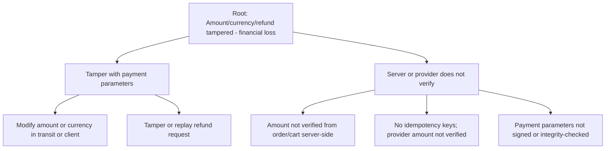

---

### 3.3 Repudiation: Dispute or chargeback with no proof

**Root:** Dispute or chargeback with no clear proof of consent or transaction; no audit trail.

**Attack paths explored:**
- Payment intent (amount, currency, user ID, idempotency key) not stored before calling provider; cannot prove what was agreed.
- Provider transaction ID or outcome not logged; no receipt or retention for PCI/regulatory.
- User consent or transaction binding not recorded; cannot demonstrate user authorized payment.

**Leaf nodes:** Payment intent not stored before calling provider; provider transaction ID/outcome not logged; no receipt or retention; user consent or transaction not recorded.

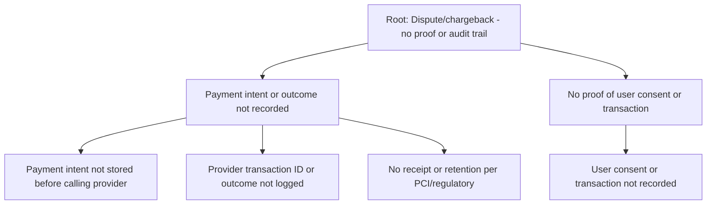

---

### 3.4 Information disclosure: Card data or PII in logs or responses

**Root:** Card data or PII exposed in logs or API responses.

**Attack paths explored:**
- Full PAN/CVV logged or stored; card data touches application stack instead of tokenization/hosted fields.
- Payment API responses include sensitive data; responses not restricted to non-sensitive fields.

**Leaf nodes:** Full PAN/CVV logged or stored; card data touches stack (no tokenization/hosted fields); Payment API responses include sensitive data.

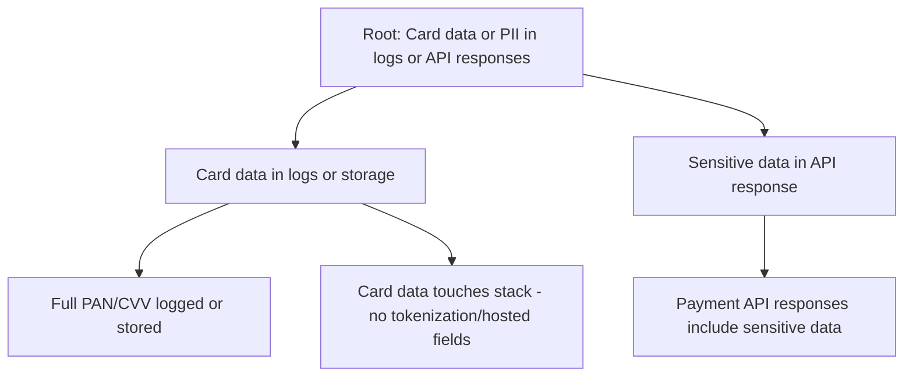

---

### 3.5 Information disclosure: Card data or PII to wrong tenant/service

**Root:** Card data or PII exposed to wrong tenant or service.

**Attack paths explored:**
- Multi-tenant or multi-service isolation failure; one tenant or service can access another’s payment/PII.
- PII or payment access controls not aligned with Auth; no tenant/service scoping.

**Leaf nodes:** Tenant or service isolation failure; PII controls not applied; no tenant/service scoping for payment data.

```mermaid
flowchart TD
    R["Root: Card/PII exposed to wrong tenant or service"]
    R --> P1["Isolation or access control failure"]
    P1 --> L1["Tenant or service isolation failure"]
    P1 --> L2["PII controls not applied like Auth"]
    P1 --> L3["No tenant/service scoping for payment data"]
```

---

### 3.6 Denial of service: Payment API unavailable

**Root:** Payment API unavailable; users cannot complete purchases; revenue and trust impact.

**Attack paths explored:**
- Provider outage or degradation; no awareness (no SLA or status page monitoring).
- No retries with backoff and idempotency; transient failures treated as hard failures.
- No graceful degradation (e.g. “payments temporarily unavailable”); no monitoring of success rate or latency.

**Leaf nodes:** Provider outage not monitored; no retries with backoff and idempotency; no graceful degradation; payment success rate or latency not monitored.

```mermaid
flowchart TD
    R["Root: Payment API unavailable - purchases fail"]
    R --> P1["Provider unavailable or degraded"]
    R --> P2["No resilience or visibility"]
    P1 --> L1["Provider outage - no SLA or status page monitoring"]
    P2 --> L2["No retries with backoff and idempotency"]
    P2 --> L3["No graceful degradation message"]
    P2 --> L4["Payment success rate or latency not monitored"]
```

---

### 3.7 Elevation of privilege: Unauthorized refund or subscription change

**Root:** Unauthorized refund or subscription change (Payment API called without proper authorization).

**Attack paths explored:**
- Refund or subscription change initiated from client or without tying to authenticated user/operator.
- Refund policy not enforced (e.g. refund for different user or without support audit); client has direct Payment API keys.
- Admin refunds not gated by RBAC; any operator can issue refund.

**Leaf nodes:** Refund/subscription from client or wrong identity; refund not limited to same user or support with audit; client-side Payment API keys; no RBAC for admin refunds.

```mermaid
flowchart TD
    R["Root: Unauthorized refund or subscription change"]
    R --> P1["Payment API called without proper authz"]
    P1 --> L1["Refund or subscription initiated from client"]
    P1 --> L2["Not tied to authenticated user or operator"]
    P1 --> L3["Refund for different user without support audit"]
    P1 --> L4["Client-side direct Payment API keys"]
    P1 --> L5["No RBAC for admin refunds"]
```

---

## 4. Summary: Threat-to-tree mapping

| Component    | STRIDE | Threat (root) | Section |
|-------------|--------|----------------|---------|
| API Gateway | S      | Tokens stolen → Gateway accepts as victim | 1.1 |
| API Gateway | S      | Auth bypassed → Gateway accepts as victim | 1.2 |
| API Gateway | T      | Request/response tampering in transit | 1.3 |
| API Gateway | R      | No sufficient audit trail | 1.4 |
| API Gateway | I      | Misrouting leaks PII/payment | 1.5 |
| API Gateway | I      | Verbose logging leaks PII/payment | 1.6 |
| API Gateway | D      | Platform-wide outage via Gateway | 1.7 |
| API Gateway | E      | Backends or admin routes exposed | 1.8 |
| Auth        | S      | Credential stuffing/phishing → ATO | 2.1 |
| Auth        | S      | Session token theft → act as user | 2.2 |
| Auth        | T      | Password reset tampered | 2.3 |
| Auth        | T      | Age flag tampered | 2.4 |
| Auth        | R      | No non-repudiation | 2.5 |
| Auth        | I      | PII/minors disclosed | 2.6 |
| Auth        | D      | Auth endpoint exhausted | 2.7 |
| Auth        | E      | Privilege escalation (admin) | 2.8 |
| Auth        | E      | MFA bypass | 2.9 |
| Payment     | S      | Payment as another user | 3.1 |
| Payment     | T      | Amount/currency/refund tampered | 3.2 |
| Payment     | R      | Dispute/chargeback no proof | 3.3 |
| Payment     | I      | Card/PII in logs or responses | 3.4 |
| Payment     | I      | Card/PII to wrong tenant/service | 3.5 |
| Payment     | D      | Payment API unavailable | 3.6 |
| Payment     | E      | Unauthorized refund/subscription | 3.7 |

---

## How to use these trees

1. **Visualize:** Render the Mermaid blocks in any [Mermaid-capable viewer](https://mermaid.js.org/) (e.g. GitHub, VS Code with Mermaid extension, or [mermaid.live](https://mermaid.live)).
2. **Prioritize:** Focus on Critical and High threats (sections 1.7, 2.1, 2.2, 2.6, 2.7, 3.1, 3.4, 3.5 and corresponding trees).
3. **Mitigate:** For each leaf or path, map to the actionable mitigations in `report.md` and close gaps (e.g. staging for Gateway, token binding for Auth, identity binding for Payment).
4. **Re-assess:** When design or controls change, update the trees and re-evaluate paths (per NCSC: review by subject matter expert and update nodes as appropriate).

Reference: [NCSC – Using attack trees to understand cyber security risk](https://www.ncsc.gov.uk/collection/risk-management/using-attack-trees-to-understand-cyber-security-risk).
